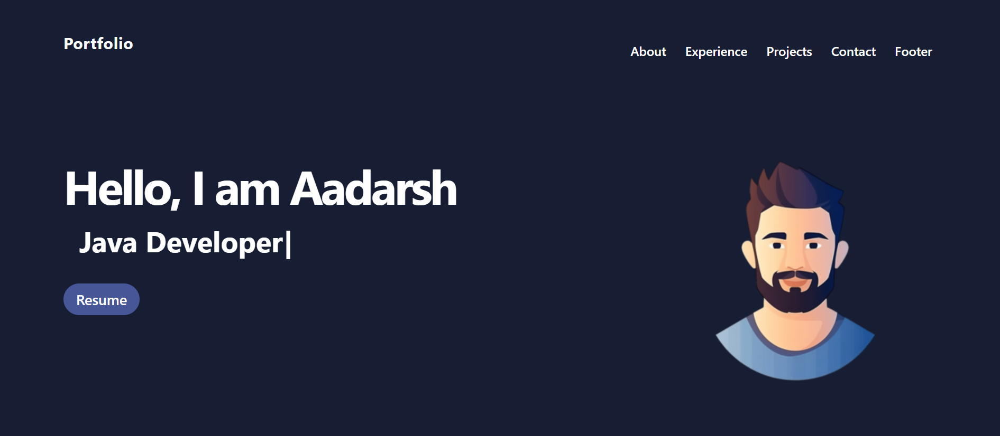
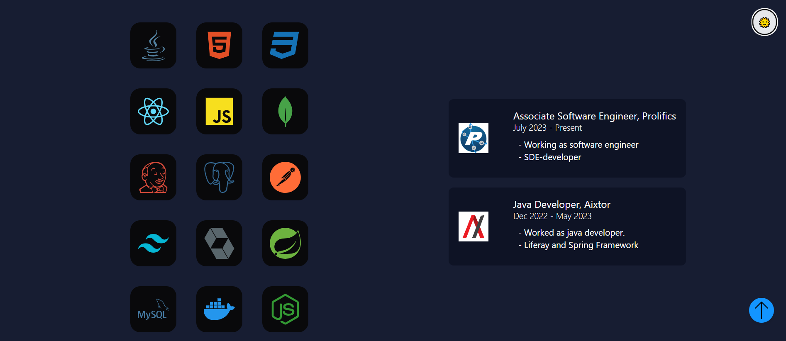
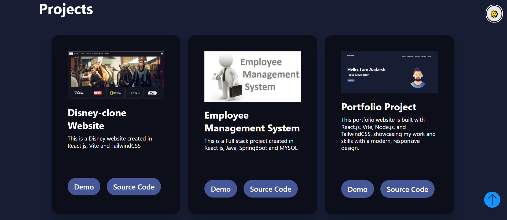
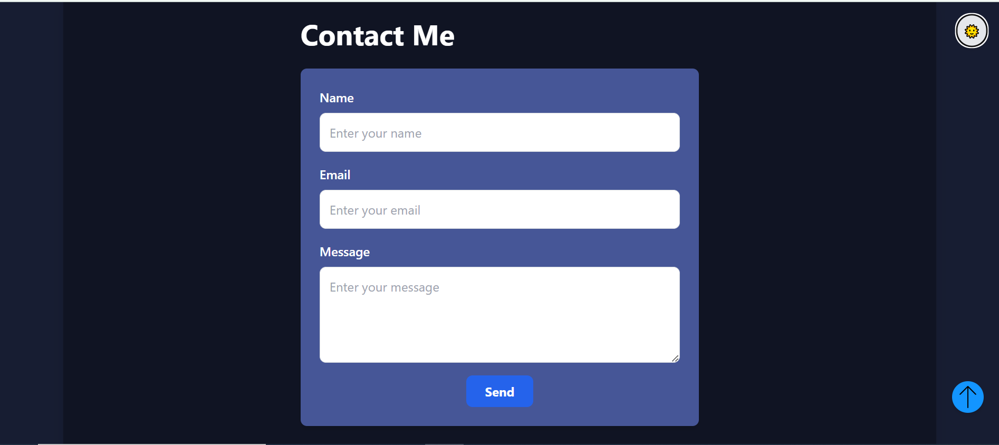

# Portfolio

Welcome to my Portfolio! This project showcases my professional profile, including my education, skills, and experience. Additionally, it features a contact form that allows anyone to reach out to me via email.

## Technologies Used

- **Frontend**: React, Vite, and various libraries
- **Backend**: Node.js

## Features

- **Responsive Design**: The portfolio is designed to be responsive, ensuring a great user experience on all devices.
- **Contact Form**: Users can easily contact me through a form that sends messages to my email.

## Getting Started

To run this project locally, follow these steps:

1. Clone the repository:
   ```bash
   git clone https://github.com/yourusername/portfolio.git
   ```

2. Navigate to the project directory:
   ```bash
   cd portfolio
   ```

3. Install the dependencies:
   ```bash
   npm install
   ```

4. Run the development server:
   ```bash
   npm run dev
   ```

5. Open your browser and go to [http://localhost:5173/](http://localhost:5173/) to view the portfolio.

## Contact

Feel free to reach out to me through the contact form in the portfolio or directly via email at [adarshgupta91111@gmail.com](mailto:adarshgupta91111@gmail.com).

## Screenshots

Here are some screenshots of my portfolio:

1. **Home Page**
   

2. **Skills and Experience Section**
   

3. **Projects Section**
   

4. **Contact Form**
   

Feel free to explore the project to see these features in action!

---

Thank you for visiting my portfolio!
